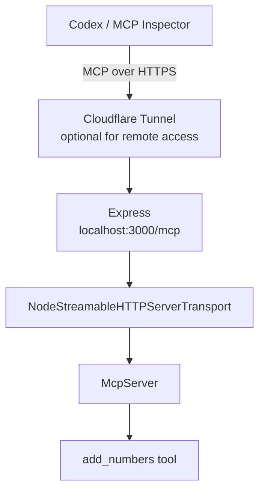

# Express HTTP MCP server

A minimal TypeScript MCP server that exposes one tool over Streamable HTTP. It runs locally with Express on port `3000`; Cloudflare Tunnel can make its `/mcp` endpoint reachable by a remote MCP client such as Codex.

## What we built



The project has three source files:

```text
src/
├── index.ts              # Express startup and endpoint mounting
├── routes/
│   └── mcp.route.ts      # POST /mcp and MCP HTTP transport
└── server/
    └── mcp.ts            # McpServer and registered tools
```

## Install and run

```bash
npm install
npm run dev
```

The server starts at `http://localhost:3000`.

Check that Express is running:

```bash
curl http://localhost:3000/health
```

Expected response:

```json
{ "msg": "MCP Server is live and healthy." }
```

## The MCP tool

`src/server/mcp.ts` creates an `McpServer` named `add-numbers-server` and registers this tool:

```text
add_numbers({ a: number, b: number })
```

The tool's name, description, and Zod schema are sent to the MCP client when it requests `tools/list`. An LLM reads that public contract to decide whether it should call the tool. The handler implementation remains on this server.

> Note: the current demonstration handler calculates `a * b`, even though the tool is named and described as addition. This README documents the current behavior; change the handler to `a + b` when you want the implementation to match the name.

## Express endpoints

| Endpoint | Purpose |
| --- | --- |
| `GET /health` | Normal HTTP health check for a browser, curl, or uptime monitor. |
| `POST /mcp` | The single MCP protocol endpoint. MCP clients use it for initialization, tool discovery, and tool calls. |

This is not a REST API with endpoints such as `/add_numbers`. MCP clients send JSON-RPC messages to `/mcp`, and the transport routes them to registered MCP tools.

## How an MCP call flows

An MCP client sends messages such as:

```text
initialize  -> negotiate the MCP connection
tools/list  -> discover add_numbers and its input schema
tools/call  -> call add_numbers with { a, b }
```

The response comes back through the same HTTP request:

```text
client POST /mcp
-> Express router
-> MCP transport
-> McpServer tool handler
-> MCP JSON-RPC response
```

## The HTTP transport explained

`src/routes/mcp.route.ts` contains the bridge between Express and MCP:

```ts
const transport = new NodeStreamableHTTPServerTransport({
  sessionIdGenerator: undefined,
});

await mcpServer.connect(transport);
await transport.handleRequest(req, res, req.body);
```

### `NodeStreamableHTTPServerTransport`

Express understands HTTP requests (`req`) and responses (`res`). MCP understands protocol messages such as `initialize`, `tools/list`, and `tools/call`. `NodeStreamableHTTPServerTransport` translates between those two layers.

```text
Express req/res <-> NodeStreamableHTTPServerTransport <-> MCP messages
```

`sessionIdGenerator: undefined` selects stateless operation. Each request is handled independently and the server does not create or retain an MCP session ID. That is appropriate for this arithmetic tool because the request contains everything the handler needs.

For stateful MCP later, a generator can create a unique session ID. That change also requires storing and reusing the transport for the matching session; changing only this option is not enough.

### `await mcpServer.connect(transport)`

`mcpServer` knows the registered tools. `transport` knows how to communicate over HTTP. This line attaches them.

After connecting, the transport can ask `mcpServer` for its tools when the client sends `tools/list`, or invoke `add_numbers` when the client sends `tools/call`.

### `await transport.handleRequest(req, res, req.body)`

This handles one incoming MCP HTTP request.

- `req` is the full Express request.
- `res` is the Express response that will receive the MCP result.
- `req.body` is the parsed JSON-RPC message sent by the MCP client.

The transport reads the message, invokes the appropriate MCP behavior, and writes the JSON-RPC response to `res`. The Express route should not manually call `res.json()` for successful MCP tool results; the transport owns that protocol response.

## Test with MCP Inspector

1. Start the server with `npm run dev` and leave it running.
2. Start MCP Inspector:

   ```bash
   npx @modelcontextprotocol/inspector
   ```

3. In Inspector, select **Streamable HTTP** and connect to:

   ```text
   http://localhost:3000/mcp
   ```

4. Open **Tools**, list tools, select `add_numbers`, and call it with:

   ```json
   { "a": 2, "b": 3 }
   ```

## Remote testing with Cloudflare Tunnel and Codex

With the server still running locally, expose port `3000` through Cloudflare Tunnel. Use the tunnel's public HTTPS address with `/mcp` appended:

```text
https://your-tunnel-url/mcp
```

First verify that public endpoint in MCP Inspector. Then register it with Codex:

```bash
codex mcp add add-numbers --url https://your-tunnel-url/mcp
codex mcp list
```

Start a new Codex session after adding the server, then ask it to use `add_numbers`.

## Current limitations

- No authentication or authorization: anyone who knows the tunnel URL can call the tool.
- No database or persistent user data.
- No rate limiting, audit logging, automated tests, or deployment process.
- A quick Cloudflare Tunnel is useful for learning and testing; it is not a permanent production deployment.
- Error responses currently include the caught error object. In a production server, log the original error privately and return a safe generic message to the client.

## next steps

1. Correct the arithmetic implementation, then add a few useful tools.
2. Add authentication and authorization so tool calls are user-scoped.
3. Learn stateful sessions only when a tool requires per-connection workflow state.
4. Add database persistence, tests, rate limiting, audit logs, and safe confirmation for destructive actions.
5. Deploy the service behind a permanent HTTPS endpoint before exposing real user data or side-effecting tools.
