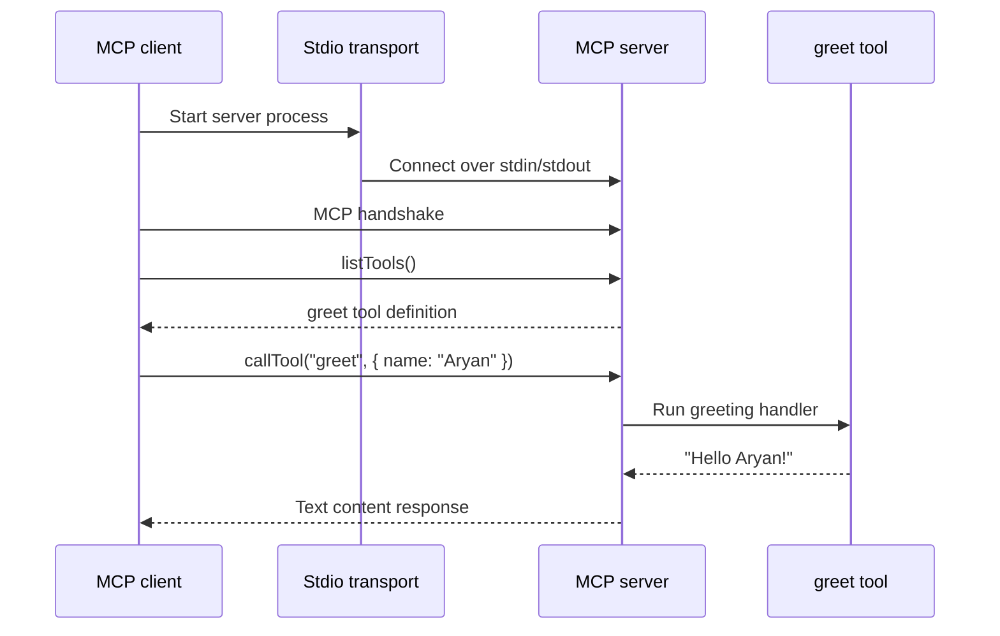

# MCP Greeting Example

This project is a small, hands-on introduction to the [Model Context Protocol (MCP)](https://modelcontextprotocol.io/). It contains an MCP client and server that communicate over standard input/output (stdio).

The server exposes one tool, `greet`, which accepts a person's name and returns a greeting. The client launches the server, completes the MCP handshake, discovers the available tools, and invokes `greet` with `Aryan`.



## Project structure

```
src/
├── client.ts  # Starts the server, lists tools, and calls greet
└── server.ts  # Registers the MCP server and greet tool
```

## Run it

From this directory, run:

```bash
npx tsx src/client.ts
```

The client prints the tools exposed by the server and the greeting returned from the `greet` tool.

## Related article

This example accompanies the technical blog post: [Model Context Protocol (MCP) - Aryan Chauhan](https://cerebrum.super.site/spekiyy/model-context-protocol-mcp).
